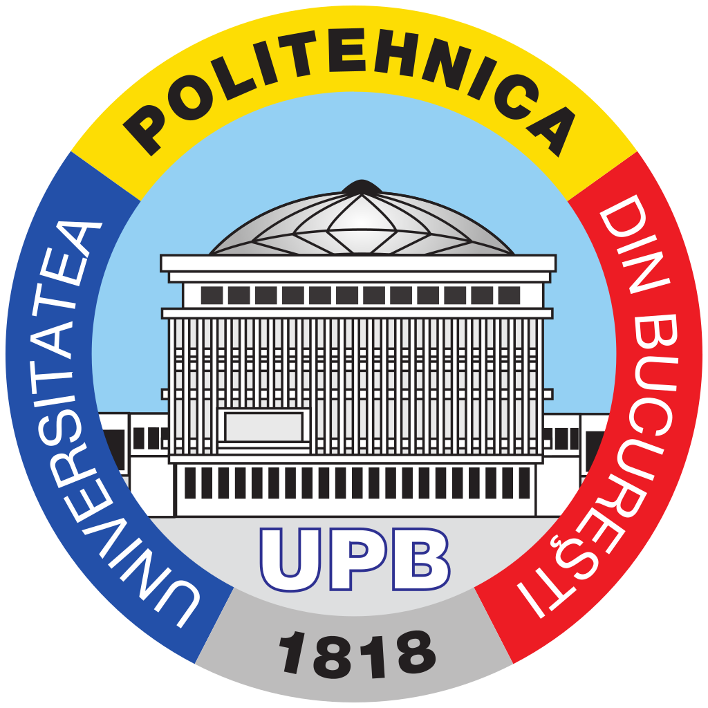
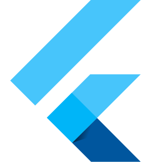
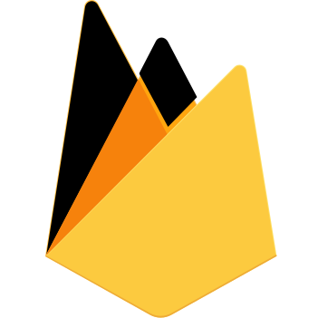
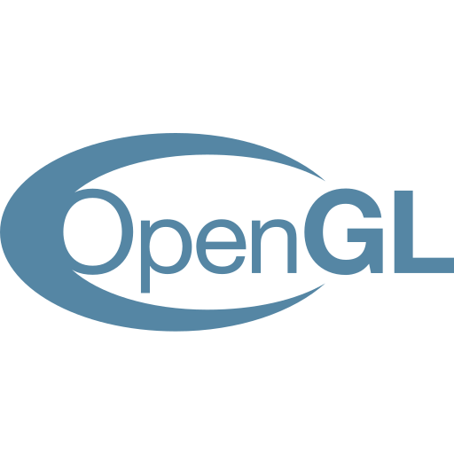
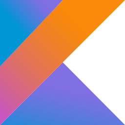

# Bio

I work as a software engineer in Google and I am currently pursuing a Master's degree in Graphics, Multimedia and Virtual Reality at University POLITEHNICA of Bucharest. I enjoy mobile development and I am trying to learn more about UX/UI design.

My mission is to help grow the next generation of software developers. I practice teaching and mentoring through my position as a Teaching Assistant in my university, as well as through managing a team of students who contribute on [a mobile application](https://github.com/acs-upb-mobile/acs-upb-mobile) for our student community. Furthermore, in my role as a Microsoft Learn Student Ambassador, I mentor other student ambassadors and organise various events featuring Microsoft technologies.

# Education

<table>
  <tr>
    <td style="vertical-align: middle; padding-right: 4px; width: 58px">
      
    </td>
    <td style="border-bottom-width: 3px">
      <h4>University POLITEHNICA of Bucharest<h4> 
      <h6>Master's degree in Graphics, Multimedia and Virtual Reality<h6>
    </td>
    <td style="text-align: right; vertical-align: middle; font-style: italic; border-bottom-width: 3px">
      2020 - present
    </td>
  </tr>
  <tr>
    <td style="vertical-align: middle; padding-right: 4px; width: 58px">
      
    </td>
    <td>
      <h4>University POLITEHNICA of Bucharest<h4> 
      <h6>Bachelor's degree in Computer Science<h6>
    </td>
    <td style="text-align: right; vertical-align: middle; font-style: italic">
      2016 - 2020
    </td>
  </tr>
</table>

# Work experience

<table>
  <tr>
    <td style="vertical-align: middle; padding-right: 4px; width: 58px">
      
    </td>
    <td>
      <h4>Google<h4> 
      <h6>Software Engineer<h6>
    </td>
    <td style="text-align: right; vertical-align: middle; font-style: italic">
      2020 - present
    </td>
  </tr>
  <tr>
    <td colspan="3" style="border-bottom-width: 3px;">
      Will start working in November 2020 as part of the storage infrastructure team in Zürich, Switzerland.
    </td>
  </tr>
  <tr>
    <td style="vertical-align: middle; padding-right: 4px; width: 58px">
      
    </td>
    <td>
      <h4>Google<h4> 
      <h6>Software Engineering Intern<h6>
    </td>
    <td style="text-align: right; vertical-align: middle; font-style: italic">
      summer 2019
    </td>
  </tr>
  <tr>
    <td colspan="3" style="border-bottom-width: 3px;">
      Worked as an iOS back-end developer in the mobile data infrastructure team in Zürich, Switzerland.
    </td>
  </tr>
  <tr>
    <td style="vertical-align: middle; padding-right: 4px; width: 58px">
      
    </td>
    <td>
      <h4>Google<h4> 
      <h6>Software Engineering Intern<h6>
    </td>
    <td style="text-align: right; vertical-align: middle; font-style: italic">
      summer 2018
    </td>
  </tr>
  <tr>
    <td colspan="3" style="border-bottom-width: 3px;">
      Developed a new feature as part of the Android Studio team in London, UK.
    </td>
  </tr>
  <tr>
    <td style="vertical-align: middle; padding-right: 4px; width: 58px">
      
    </td>
    <td>
      <h4>University POLITEHNICA of Bucharest<h4> 
      <h6>Teaching Assistant<h6>
    </td>
    <td style="text-align: right; vertical-align: middle; font-style: italic">
      2017 - present
    </td>
  </tr>
  <tr>
    <td colspan="3" style="border-bottom-width: 0px;">
      Teaching introductive classes on programming, data structures (in C) and object-oriented programming (in Java).
    </td>
  </tr>
</table>

# Volunteering

<table>
  <tr>
    <td style="vertical-align: middle; padding-right: 4px; width: 58px">
      
    </td>
    <td>
      <h4>Microsoft<h4> 
      <h6>Microsoft Learn Student Ambassador (Beta)<h6>
    </td>
    <td style="text-align: right; vertical-align: middle; font-style: italic">
      2018 - present
    </td>
  </tr>
  <tr>
    <td colspan="3" style="border-bottom-width: 3px;">
      Participating in and organising workshops and events featuring various Microsoft technologies. For more information about our team's activity, check <a target="_blank" href="https://www.facebook.com/microsoft.pub.ro/">our Facebook page</a>.
    </td>
  </tr>
  <tr>
    <td style="vertical-align: middle; padding-right: 4px; width: 58px">
      
    </td>
    <td>
      <h4>Codette<h4> 
      <h6>Trainer<h6>
    </td>
    <td style="text-align: right; vertical-align: middle; font-style: italic">
      2017 - 2018
    </td>
  </tr>
  <tr>
    <td colspan="3" style="border-bottom-width: 0px;">
    <a target="_blank" href="https://codette.ro/">Codette</a> is a community for women with a passion for IT&C that organizes a series of events centered on
education, inclusion and personal development. I took part in IT-related
workshops (<a target="_blank" href="https://codette.ro/blog/pycodette-bazele-programarii-and-more/">Py@Codette</a> – Python workshop) as both participant and trainer, and various
events (<a target="_blank" href="https://blogs.adobe.com/adobelife/2017/03/23/codette4web-powered-by-adobe/">Codette4Web</a> – powered by Adobe Romania, involving discussions about web services), as well as contributed with articles for the community blog.
    </td>
  </tr>
</table>

# Skills

## Technologies

## Programming languages

<h3 style="color: grey;">Main languages</h3>

<h3 style="color: grey;">Personal GitHub repository languages</h3>
<iframe style="height: 600px; width: 600px;" src="http://ionicabizau.github.io/github-profile-languages/api.html?IoanaAlexandru" frameborder="0"></iframe>
